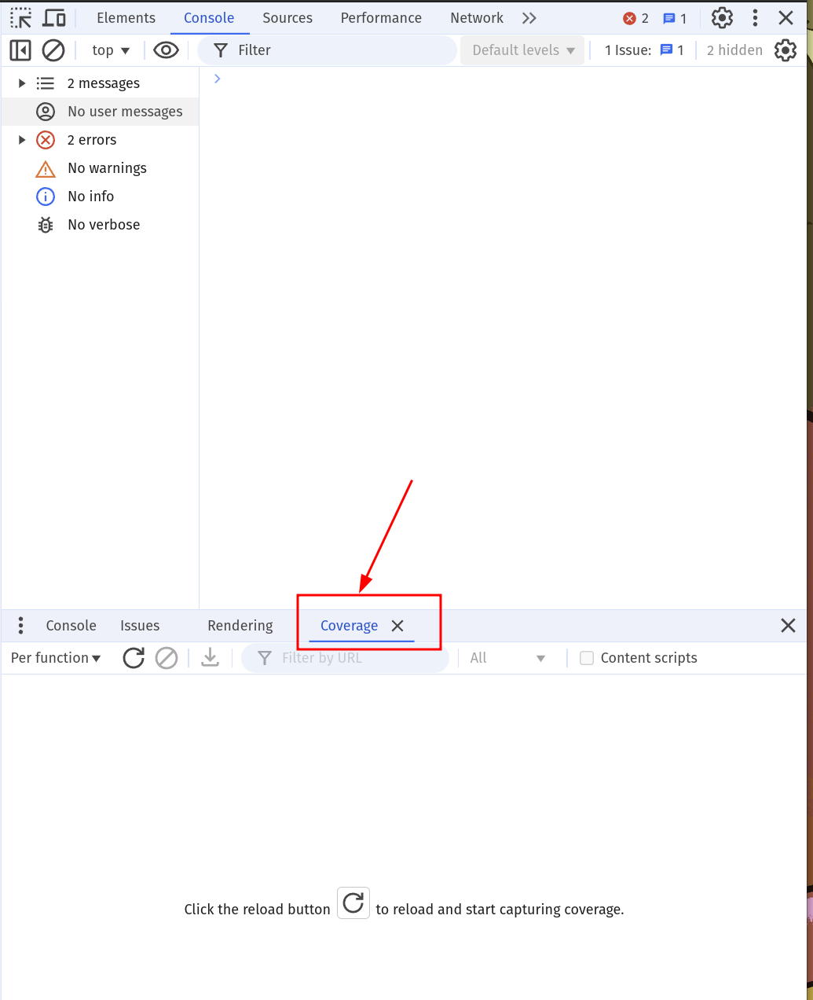
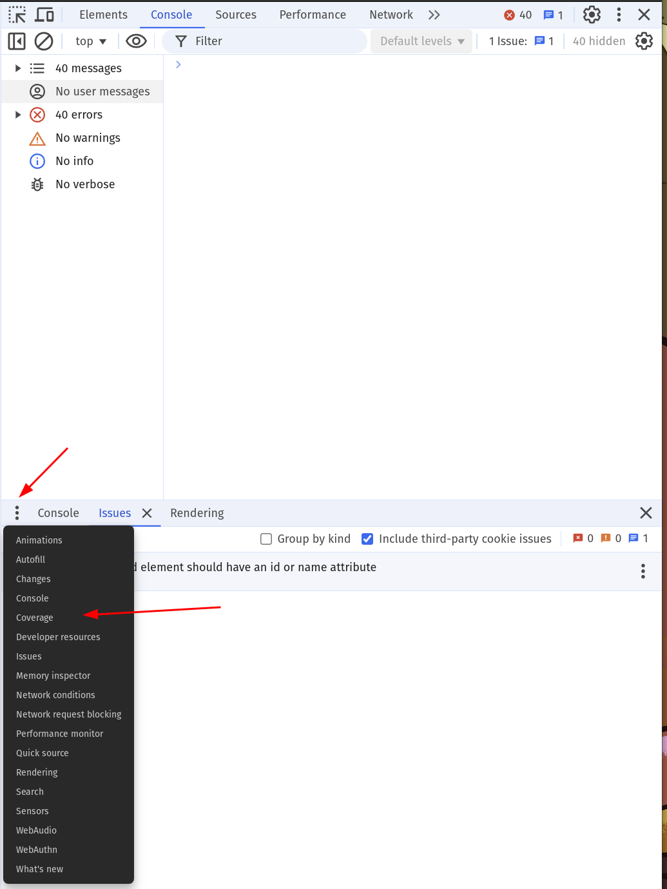
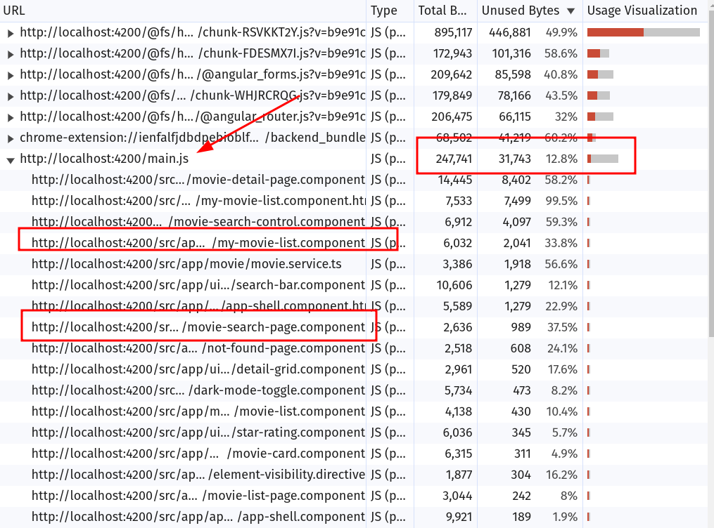
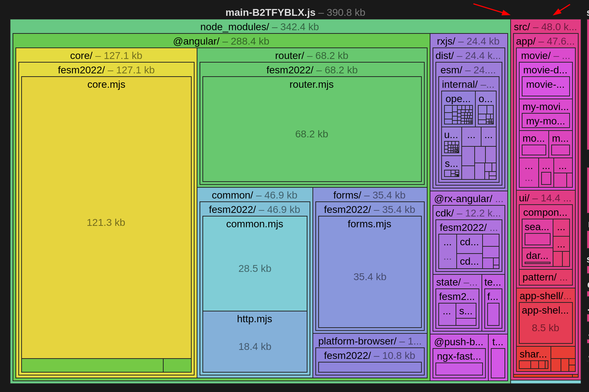

# Bundle Analysis: Coverage & Bundle Analyzer

In this exercise we will get to know tools to analyse the generated bundles
and the code coverage of our application.
This helps us to improve the LCP later by finding candidates that should
not be part of the initial chunks that are downloaded.

## 1. Code Coverage Audit

The first step you should always do is to perform a `code coverage` report.

Serve the app (if it is not running yet) and open `http://localhost:4200/list/popular`:

```bash
npx nx serve movies
```

Open the chrome dev tools and navigate to the `Coverage` tab. It's most probably
part of your bottom pane.

Press the `ESC` button to open the bottom pane to find the `Coverage` tab.



If you can't find the `Coverage` tab right away,
it's hidden behind the `3-dot` menu on the left.



> [!TIP]
> Still not there? Press `Ctrl + Shift + P` (`Cmd + Shift + P` on Mac) in the dev tools and run `Show Coverage`.

Click the reload button in the `Coverage` tab: it reloads the page and records which bytes of each file are used.
Do the same on a movie detail page (click a movie) for comparison.

**Expected result:** a list of JavaScript and CSS files with their unused bytes. The dev server serves the code
unbundled, so you see:

- `main.js` and a few `chunk-….js` files — our code. Expand `main.js`: it holds the app shell, the routes and
  the app config. Most of `libs/...` sits in the `chunk-….js` files next to it.
- one file per npm package — `@angular_core.js`, `@angular_router.js`, `@angular_forms.js`, … — and
  `zone__js.js`, loaded by `polyfills.js`.



<details>
  <summary>What should not be there?</summary>

- `@angular_forms.js` is loaded on `/list/popular`, a page without a form. The app shell imports `FormsModule` and
  `ReactiveFormsModule` for a single `[(ngModel)]` on its search bar (`<ui-search-bar>`, a `ControlValueAccessor`) —
  so the whole forms package is part of the initial code of every page.
- `zone__js.js` (via `polyfills.js`) is zone.js. The app still runs with `provideZoneChangeDetection()`; once it is
  zoneless (block 2), the whole file can go.
- The page components are **not** in `main.js` — every page is lazy loaded from its own chunk.

</details>

## 2. Bundle analysis

To get even more details about the generated bundles,
we can use the [`esbuild bundle analyzer`](https://esbuild.github.io/analyze/).

In order to generate the needed output, generate a production build:

```shell
npx nx build movies --stats-json
```

The build also tells you about the `initial chunk files`. Those are the ones that
are added into the `index.html` and will always be fetched immediately.

**Expected result** (the hashes in the file names differ on your machine):

```text
Initial chunk files   | Names         |  Raw size | Estimated transfer size
main-35GVQ53I.js      | main          | 239.32 kB |                58.39 kB
chunk-CEDsHtSe.js     | -             | 160.20 kB |                47.35 kB
polyfills-LUQ3FE2X.js | polyfills     |  34.59 kB |                11.33 kB
styles-45L7TMEG.css   | styles        |   8.51 kB |                 2.11 kB

                      | Initial total | 442.61 kB |               119.17 kB

Lazy chunk files      | Names         |  Raw size | Estimated transfer size
chunk-DBgUN7Hy.js     | index         |   9.43 kB |                 2.71 kB
chunk-TEqKaBXV.js     | -             |   7.64 kB |                 2.54 kB
...
```

The production build bundles everything — our code and the npm packages — into a few chunks. Three JavaScript
files are initial: `main`, a shared chunk without a name and `polyfills`. Enterprise grade applications can have
several 100 chunks, the initial ones are the ones that count for the first page load.

The lazy chunks named `index` are the feature libraries (one per route) — esbuild names them after the
library's entry file `src/index.ts`.

We only want to focus on the `initial chunk files` for an analysis like this.

The build now produces a `dist/apps/movies/browser-stats.json`.

Upload the generated file to the [esbuild bundle analyzer](https://esbuild.github.io/analyze/) and
inspect the result.

Here you get presented a `tree map` of the bundle. Feel free to spend some time on
digging into the chart.

The tree map shows you the exact same bundles as mentioned by the build output.
Open `main-….js` and find the code that we consider as `1st party` (`libs/` and `apps/`) and the
`3rd party` code (`node_modules/`).



<details>
  <summary>What is in the initial chunks?</summary>

- `main` (239 kB): mostly 3rd party — `@angular/router` (~99 kB), `@angular/forms` (~54 kB), `@angular/common`
  (~54 kB), `@rx-angular/*` (~29 kB), `@angular/platform-browser` (~16 kB), `@push-based/ngx-fast-svg` (~7 kB).
  Our own code is only ~37 kB: the app shell (`feature-app-shell`), the design system (`ui-design-system`, used by
  the shell), `data-access`, `utils`, `data-access-auth`, `util-env` and the app itself.
- the shared chunk (160 kB): `@angular/core` and `rxjs` — needed by `main` and by the lazy chunks.
- `polyfills` (35 kB): `zone.js`.
- The pages (`feature-*` libraries) and `ui-movie-list` are **not** initial — they are in the lazy chunks.

</details>