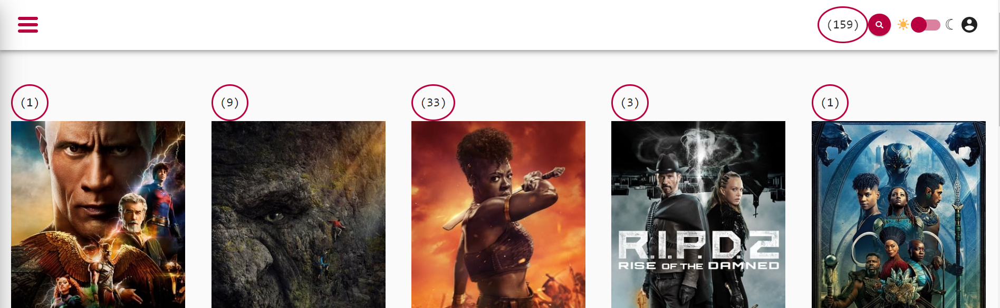

# ChangeDetection - Dirty Check Exercise

In this exercise we will make the `ChangeDetection` system of angular visible. Before we can do any optimization,
let's get a picture of the current state.

The workspace already ships a little helper component that counts how often change detection checks the component
it is placed in: `DirtyCheckComponent` in `libs/shared/utils/src/lib/dirty-check/dirty-check.component.ts`,
exported from `@movies/shared/utils`.

## 1. How the dirty-check component works (optional)

<details>
    <summary>DirtyCheckComponent</summary>

Whenever change detection checks the host component, the `ngDoCheck` hook of the `DirtyCheckComponent` runs and
increases the `checked` signal.

```ts
// libs/shared/utils/src/lib/dirty-check/dirty-check.component.ts

import { Component, DoCheck, signal } from '@angular/core';

/** Counts how often its host view is checked. Use `<dirty-check />` in a template. */
@Component({
  selector: 'dirty-check',
  template: ` <code class="dirty-checks">({{ checked() }})</code> `,
  styles: [
    `
      :host {
        display: inline-block;
        border-radius: 100%;
        border: 2px solid var(--palette-secondary-main);
        padding: 1rem;
        font-size: var(--text-lg);
      }
    `,
  ],
})
export class DirtyCheckComponent implements DoCheck {
  checked = signal(0);

  ngDoCheck() {
    this.checked.update((c) => c + 1);
  }
}
```

</details>

## 2. Use the dirty-check component

Place `<dirty-check />` in three components to visualize their respective amount of dirty checks while the
application is running. Keep the counters for the following change detection exercises.

### 2.1 Use in `AppComponent`

Import `DirtyCheckComponent`, add it to the `imports` array and put `<dirty-check />` into the template:

```ts
// apps/movies/src/app/app.component.ts

import { DirtyCheckComponent } from '@movies/shared/utils'; // 👈️ add this

@Component({
  selector: 'app-root',
  template: `
    <app-shell>
      <dirty-check />
      <router-outlet />
    </app-shell>
  `,
  changeDetection: ChangeDetectionStrategy.Eager,
  imports: [RouterOutlet, AppShellComponent, DirtyCheckComponent],
})
export class AppComponent {}
```

### 2.2 Use in `MovieListPageComponent`

Same for `libs/movies/feature-movie-list/src/lib/movie-list-page/movie-list-page.component.ts`, put
`<dirty-check />` above `<movie-list>`:

```ts
// libs/movies/feature-movie-list/src/lib/movie-list-page/movie-list-page.component.ts

import {
  DirtyCheckComponent,
  ElementVisibilityDirective,
} from '@movies/shared/utils';

@Component({
  selector: 'movie-list-page',
  template: `
    <dirty-check />
    <movie-list
      [movies]="movies"
      [favoriteMovieIds]="favoriteMovieIds"
      (favoriteToggled)="handleFavoriteToggled($event)"
    />
    <div (elementVisible)="paginate$.next()"></div>
  `,
  changeDetection: ChangeDetectionStrategy.Eager,
  imports: [
    MovieListComponent,
    ElementVisibilityDirective,
    DirtyCheckComponent,
  ],
})
export class MovieListPageComponent {
  // ...
}
```

### 2.3 Use in `MovieCardComponent`

Same for `libs/movies/ui-movie-list/src/lib/movie-card/movie-card.component.ts`, put `<dirty-check />` as the
first child of `.movie-card`:

```html
<!-- libs/movies/ui-movie-list/src/lib/movie-card/movie-card.component.ts (template) -->

<div class="movie-card">
  <dirty-check /> <!-- 👈️ add this -->
  
  <!-- the rest of the template stays as it is -->
</div>
```

```ts
// libs/movies/ui-movie-list/src/lib/movie-card/movie-card.component.ts

import { DirtyCheckComponent, TiltDirective } from '@movies/shared/utils';

@Component({
  selector: 'movie-card',
  // ...
  changeDetection: ChangeDetectionStrategy.Eager,
  imports: [
    TiltDirective,
    StarRatingComponent,
    UpperCasePipe,
    MovieImagePipe,
    DirtyCheckComponent,
  ],
})
export class MovieCardComponent {
  // ...
}
```

## 3. Evaluate initial state of the application

Serve your app and try to interact with the page.
Perform different kinds of actions and note how the counters increase by different amounts.

* navigate
  * between categories
  * movie-detail
* tilt
* switch dark/light mode

Every interaction bumps every counter: all components are `Eager`, and zone.js ticks the whole tree.


