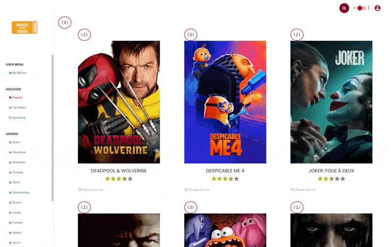

# ChangeDetection - Signals Exercise

This exercise is here to showcase how powerful signal change detection is. Keep the `<dirty-check />` counters
from the [Dirty Check exercise](./change-detection%20-%20Dirty%20Check.md).

## TiltDirective signal CD

**0. Make `MovieCardComponent` OnPush**

In `libs/movies/ui-movie-list/src/lib/movie-card/movie-card.component.ts`, delete the
`changeDetection: ChangeDetectionStrategy.Eager` line and the now unused import. Without it, the component uses
`OnPush` — the default since Angular 22.

```diff
// libs/movies/ui-movie-list/src/lib/movie-card/movie-card.component.ts

import {
- ChangeDetectionStrategy,
  Component,
  ElementRef,
  EventEmitter,
  Input,
  Output,
} from '@angular/core';

@Component({
  // ...
- changeDetection: ChangeDetectionStrategy.Eager,
  imports: [
    // ...
  ],
})
export class MovieCardComponent {}
```

Hover over the movie cards: the card counters stop — and the tilt breaks. The `TiltDirective` writes a plain
field in a `fromEvent` subscription, which doesn't mark the OnPush card dirty.

**1. Transform `rotate` into a signal**

Open the `TiltDirective` (`libs/shared/utils/src/lib/tilt.directive.ts`).
Refactor the `rotate` field from a plain property to a `signal()`. Set the initial value to `rotate(0deg)`.
Update the code that updates the `rotate` field to use the signal `set` api.

<details>
  <summary>TiltDirective rotate signal</summary>

```diff
// libs/shared/utils/src/lib/tilt.directive.ts

- import { Directive, ElementRef, Input } from '@angular/core';
+ import { Directive, ElementRef, Input, signal } from '@angular/core';
```

```diff
- rotate = 'rotate(0deg)';
+ rotate = signal('rotate(0deg)');
```

```diff
merge(rotate$, reset$).subscribe((rotate) => {
- this.rotate = rotate;
+ this.rotate.set(rotate);
});
```

</details>

**2. Update host binding to call the signal**

In order for everything to work, we need to call the signal in the host binding.

<details>
  <summary>TiltDirective use signal in {host} decorator style</summary>

```ts
// libs/shared/utils/src/lib/tilt.directive.ts

@Directive({
  selector: '[tilt]',
  host: {
    '[style.transform]': 'rotate()', // <-- update this line
  },
})
export class TiltDirective {
  //...
}
```

</details>

Hover over the movie cards again: the tilt works, and only the hovered card's counter increases.

<details>
  <summary>Signals ChangeDetection result</summary>

#### Explanation:
- The TiltDirective uses a signal to update the rotation value
- The hovered `MovieCardComponent` is refreshed (the counter increases) because a signal was updated, its OnPush
  siblings are skipped (Local Change Detection)
- The parents are still checked: they are `Eager` and zone.js ticks the whole tree. That changes when we go
  [zoneless](./change-detection%20-%20zoneless.md).



</details>


## Check out Matthieu Riegler's Demo !!!

https://jeanmeche.github.io/angular-change-detection/
