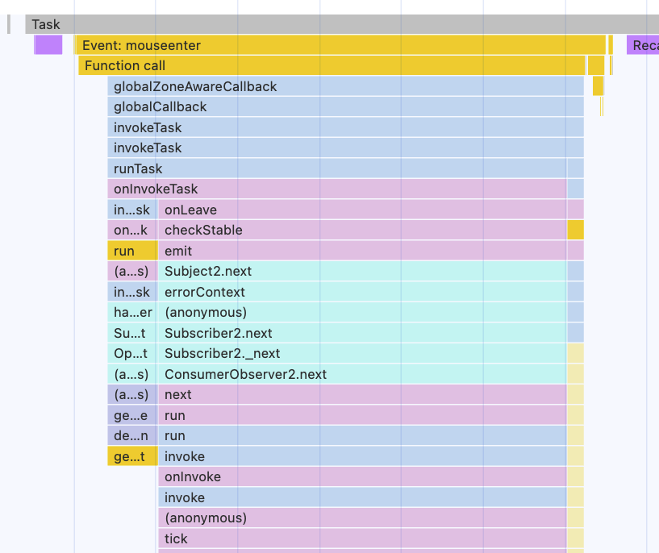
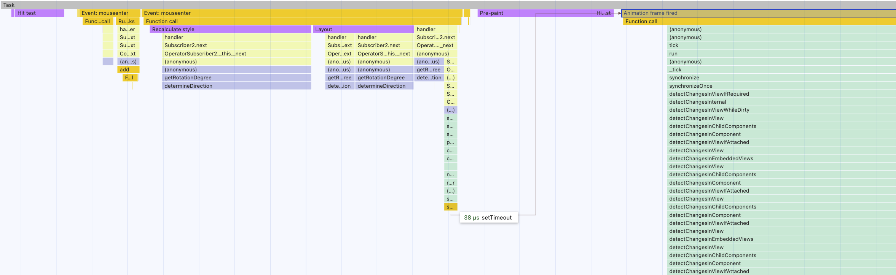

# ChangeDetection - Going zoneless Exercise

In this exercise you'll remove zone.js from the application. Zoneless change detection is the default since
Angular 21 — this app opts back into zone.js explicitly.

## 1. Remove zone.js

**1.1 Remove the zone provider**

Open `apps/movies/src/main.ts` and remove `provideZoneChangeDetection()` together with its import:

```ts
// apps/movies/src/main.ts

import { bootstrapApplication } from '@angular/platform-browser';

import { AppComponent } from './app/app.component';
import { appConfig } from './app/app.config';

bootstrapApplication(AppComponent, appConfig).catch((err) =>
  console.error(err),
);
```

**1.2 Remove the zone.js polyfill**

Without the provider, Angular doesn't use zone.js anymore — but it is still loaded and monkeypatches all browser APIs.
Remove the `polyfills` line from the `build` target in `apps/movies/project.json`:

```diff
// apps/movies/project.json

"index": "apps/movies/src/index.html",
-"polyfills": ["zone.js"],
"tsConfig": "apps/movies/tsconfig.app.json",
```

**1.3 Remove the dependency**

```bash
npm uninstall zone.js
```

Run `npx nx build movies`: the `polyfills` chunk is gone.

## 2. Observe what breaks

Restart the dev server (`project.json` changed) and open the app: the list stays empty until you click
something. `MovieListPageComponent` writes `movies` in a `subscribe` — without zone.js, nobody tells Angular to
run change detection.

> [!NOTE]
> The movies show up anyway? Reload a few times — sometimes another change detection run (the side drawer's
> genres request) renders them by accident.

## 3. Fix it with signals

Open `libs/movies/feature-movie-list/src/lib/movie-list-page/movie-list-page.component.ts`:

* turn `movies` and `favoriteMovieIds` into signals
* use `set` wherever they are written
* call the signals in the template

<details>
  <summary>MovieListPageComponent with signals</summary>

```diff
// libs/movies/feature-movie-list/src/lib/movie-list-page/movie-list-page.component.ts

- import { ChangeDetectionStrategy, Component } from '@angular/core';
+ import { ChangeDetectionStrategy, Component, signal } from '@angular/core';
```

```diff
<movie-list
-  [movies]="movies"
-  [favoriteMovieIds]="favoriteMovieIds"
+  [movies]="movies()"
+  [favoriteMovieIds]="favoriteMovieIds()"
  (favoriteToggled)="handleFavoriteToggled($event)"
/>
```

```diff
- movies: TMDBMovieModel[] = [];
+ movies = signal<TMDBMovieModel[]>([]);

- favoriteMovieIds = new Set<string>();
+ favoriteMovieIds = signal(new Set<string>());
```

```diff
// both subscriptions in the constructor
).subscribe((movies) => {
-  this.movies = movies;
+  this.movies.set(movies);
});
```

```diff
loadFavorites() {
-  this.favoriteMovieIds = this.movieService
-    .getFavorites()
-    .reduce((acc, movie) => {
+  this.favoriteMovieIds.set(
+    this.movieService.getFavorites().reduce((acc, movie) => {
      acc.add(movie.id);
      return acc;
-    }, new Set<string>());
+    }, new Set<string>()),
+  );
}
```

</details>

The movies show up again. Hover a card: now only the hovered card's counter increases — the parents stay, as
nothing ticks the whole tree anymore.

<details>
  <summary>Flamecharts before and after zoneless</summary>

### Before zoneless

zone.js will have all those: 

globalZoneAwareCallback, onInvokeTask, onHasTask, runTask, scheduleTask,
run, invoke, onInvoke, invoke and then `tick` method.



### After zoneless

Without zone.js, Angular will schedule change detection using either `setTimeout` or `requestAnimationFrame`.

This makes it easier to test and debug your application using flamecharts.



</details>
