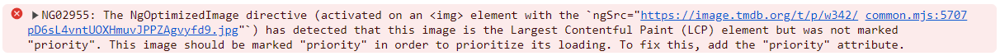

# NgOptimizedImage

In this exercise you will learn how to optimize images using the `NgOptimizedImage` directive.

## 1. Using ngSrc 

Start by adding the directive to the image tag of `MovieCardComponent`
(`libs/movies/ui-movie-list/src/lib/movie-card/movie-card.component.ts`).

- Import `NgOptimizedImage` from `@angular/common` and add it to the `imports` of the component
- Replace the `[src]` binding with `[ngSrc]`
- Make sure images have a `height` and `width`

<details>
    <summary>show solution</summary>

```ts
import { NgOptimizedImage, UpperCasePipe } from '@angular/common';

// ...

  imports: [
    TiltDirective,
    StarRatingComponent,
    UpperCasePipe,
    MovieImagePipe,
    NgOptimizedImage,
  ],
```

```html

```
</details>

Now if you open the browser console you should see that we are getting an error message.



This error is because we did not tell NgOptimizedImage if it should prioritize the image or not. 
To fix this, add the `priority` attribute to the `img` of the first card.

<details>
    <summary>show solution</summary>

Use the `index` input of the movie card to set the priority of the image.

```html

```
</details>

After this change the error should be gone from the console (now and then another poster of the first row is the LCP
— reload). The directive now warns about a missing `preconnect` for `image.tmdb.org`, see the
[preconnect exercise](network-resource-hints-preconnect.md).

See how the ngOptimizedImage directive added `eager` loading and `fetchpriority=high` to the LCP image. 🚀🚀🚀

## 2. srcset for optimized asset fetching

Every card loads the `w780` poster, no matter how small it is rendered. TMDB serves each poster in several widths
(`w154` … `w780`). With an image loader and `ngSrcset`, `NgOptimizedImage` generates a `srcset` and the browser picks
the smallest version that is sharp enough.

### 2.0 setup IMAGE_LOADER

Provide an `IMAGE_LOADER` in `apps/movies/src/app/app.config.ts` that builds the TMDB URL for a given width. Local
assets (`/assets/...`) are passed through unchanged — we need that for movies without a poster.

<details>
  <summary>IMAGE_LOADER setup</summary>

```ts
// apps/movies/src/app/app.config.ts

import { IMAGE_LOADER, ImageLoaderConfig } from '@angular/common';

// ...

export const appConfig: ApplicationConfig = {
  providers: [
    provideEnvironment(environment),
    {
      provide: IMAGE_LOADER,
      useValue: (config: ImageLoaderConfig) =>
        config.src.startsWith('/assets/')
          ? config.src
          : `https://image.tmdb.org/t/p/w${config.width ?? 300}${config.src}`,
    },
    // ...other providers
  ],
};
```

</details>

### 2.1 configure ngSrcset

Get rid of the `| movieImage` pipe (also remove `MovieImagePipe` from the `imports`) and bind `[ngSrc]` to the
`poster_path`. Movies without a poster need the fallback the pipe provided: `NgOptimizedImage` throws for an empty
`ngSrc`.

<details>
  <summary>ngSrcset configuration</summary>

```html

```

</details>

Great! Measure the impact:

* check for the LCP image (copy the file name)
* open the network tab and search for that image
* `toggle device toolbar`
* refresh the app
* start with either a small screen or large screen and adjust its size (and DPR) to test the outcome
